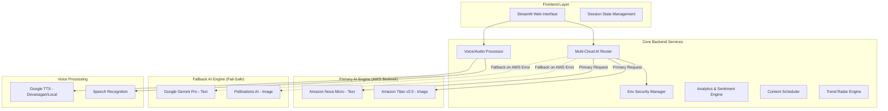

Here is the complete and updated content for your **`design.md`** file. You can copy the entire block below and paste it directly into your file:

```markdown
# Design Document: DigitalBharat Studio

## Overview

**DigitalBharat Studio** is a comprehensive, multi-cloud content workflow platform built using Streamlit for the frontend and Python for the backend. The system integrates 9 core AI-powered components: AI Content Pipeline, Script Genius, Brand Identity Kit, AI Visual Studio, Smart Content Planner, Bharat Analytics Hub, Trend Radar, AI Saarthi (Voice Co-Pilot), and AI System Controls. The architecture prioritizes enterprise-grade resilience via a Multi-Cloud Fallback system (AWS Bedrock + Google Gemini), explicitly tailored for Tier-2, Tier-3, and rural Indian content creators.

## Architecture

### High-Level Architecture



### Technology Stack Details

* **Frontend**: Streamlit with Custom CSS for responsive, mobile-friendly UI.
* **Backend & Logic**: Python 3.9+
* **Multi-Cloud AI**:
* AWS Bedrock (Amazon Nova Micro, Amazon Titan Image Generator v2:0) via `boto3`.
* Google Gemini API (`google-generativeai`) as the text fallback.
* Pollinations AI API as the visual fallback.


* **Voice Engine**: `gTTS` (Google Text-to-Speech) optimized for native Devanagari and regional Indian accents (`co.in`), and `SpeechRecognition`.
* **Data & Visualization**: Pandas, NumPy, Plotly Express, Plotly Graph Objects.
* **Security**: `python-dotenv` for strict environment variable credential shielding.

## Components and Interfaces

### 1. Multi-Cloud AI Router (System Controls)

**Purpose**: Intelligently route requests to AWS Bedrock and seamlessly failover to Google Gemini/Open Source if API limits or network blocks occur.

**Core Classes**:

```python
class MultiCloudEngine:
    def load_secure_credentials(self) -> ConfigMap:
    def get_llm_response(self, prompt: str, max_tokens: int) -> str:
    def execute_aws_primary(self, prompt: str) -> str:
    def execute_gemini_fallback(self, prompt: str, error: Exception) -> str:

```

### 2. AI Content Pipeline & Script Genius

**Purpose**: Translate complex documents into regional dialects, inject cultural slang (e.g., Puneri, Bhojpuri), and generate clickbaity hooks.

**Core Classes**:

```python
class ContentPipeline:
    def generate_base_script(self, topic: str, language: str) -> Script:
    def apply_cultural_nuance(self, base_script: str, region_vibe: str) -> LocalizedScript:
    def format_for_whatsapp(self, script: str) -> BroadcastMessage:

class ScriptGenius:
    def generate_video_script(self, topic: str, language: str, vibe: str) -> Storyboard:
    def generate_viral_hooks(self, topic: str, language: str, count: int) -> List[Hook]:

```

### 3. AI Visual Studio & Brand Identity Kit

**Purpose**: Generate 4k/8k Indian-context visuals using Titan v2:0 and synthesize niche-specific branding.

**Core Classes**:

```python
class VisualStudio:
    def build_aws_titan_payload(self, prompt: str, cfg: float, seed: int) -> Dict:
    def generate_thumbnail_aws(self, payload: Dict) -> Base64Image:
    def generate_thumbnail_fallback(self, prompt: str) -> URLImage:

class BrandIdentityKit:
    def analyze_niche_psychology(self, niche: str, target_audience: str) -> BrandProfile:
    def generate_hex_palette(self) -> List[str]:
    def define_brand_voice(self) -> str:

```

### 4. Bharat Analytics Hub & Trend Radar

**Purpose**: Provide AI sentiment analysis of regional audiences and detect hyper-local digital momentum.

**Core Classes**:

```python
class BharatAnalytics:
    def analyze_audience_sentiment(self, content_topic: str) -> SentimentReport:
    def calculate_regional_split(self) -> DataFrame:
    def generate_improvement_tips(self, sentiment: SentimentReport) -> str:

class TrendRadar:
    def scan_local_trends(self, state: str, niche: str) -> List[Trend]:
    def generate_content_alerts(self, trends: List[Trend]) -> Alert:

```

### 5. Smart Content Planner

**Purpose**: Predict optimal posting times based on specific Indian demographics.

**Core Classes**:

```python
class ContentPlanner:
    def predict_optimal_timing(self, platform: str, target_audience: str) -> OptimalTime:
    def append_to_calendar(self, entry: ScheduleEntry) -> DataFrame:

```

### 6. AI Saarthi (Voice Co-Pilot)

**Purpose**: Fully interactive multilingual AI assistant with strict native script forcing for accurate pronunciation.

**Core Classes**:

```python
class SaarthiEngine:
    def force_devanagari_script(self, prompt: str, lang: str) -> EnhancedPrompt:
    def generate_assistant_response(self, query: str, lang: str) -> str:
    def text_to_native_speech(self, text: str, lang_code: str) -> AudioStream:

```

## Data Models (Session State)

### Core Data Structures (Streamlit Managed)

```python
@dataclass
class ContentState:
    genius_script: str
    thumbnail_hooks: List[str]
    pipe_base_script: Optional[str]
    pipe_localized_script: Optional[str]
    pipe_wa_summary: Optional[str]

@dataclass
class VisualState:
    generated_thumbnail: Optional[bytes]
    thumbnail_source: str # "AWS Titan v2:0" or "Open Source Fallback"
    enhanced_image_prompt: str

@dataclass
class BrandState:
    brand_kit_generated: bool
    brand_colors: List[str]
    brand_text: str

@dataclass
class SaarthiState:
    jarvis_query: str
    jarvis_answer: str
    jarvis_audio: Optional[bytes]

```

## Error Handling & Resiliency

### 1. The Multi-Cloud Fallback Protocol

If AWS Bedrock triggers an `AccessDeniedException`, `ThrottlingException`, or `ModelNotReadyException`, the `MultiCloudEngine` catches the error silently, logs the failure, and instantly reroutes the prompt payload to the `google.generativeai` module. The user experiences slightly increased latency but ZERO application crashing.

### 2. Open Source Visual Fallback

If the Amazon Titan Image Generator payload fails, the system URL-encodes the base prompt and fetches an unbranded, seed-randomized image from `image.pollinations.ai`, ensuring the "AI Visual Studio" never returns a blank screen during a demo.

### 3. Voice Library Degradation

If `gTTS` or `SpeechRecognition` libraries fail to initialize (due to missing OS-level audio dependencies), the `GTTS_AVAILABLE` flag disables the audio player UI but keeps the Text-based AI Saarthi fully functional.

## Correctness Properties

*These properties bridge the requirements from `requirements.md` to verifiable technical implementations.*

### Property 1: Multi-Cloud Availability

*For any* text generation request, if the AWS credentials are valid and Bedrock is responsive, Amazon Nova Micro MUST be used. If it fails, the system MUST return a valid string utilizing the Gemini API fallback, ensuring 100% text generation uptime.
**Validates: Requirement 9**

### Property 2: Secure Credential Management

*For any* initialization of the `boto3` or `genai` clients, credentials MUST be loaded strictly via `os.getenv()` mapping to a `.env` file, and hardcoded keys must not exist in the execution script.
**Validates: Requirement 10**

### Property 3: Regional Localization Injection

*For any* localized content generation via the Content Pipeline, the AI MUST maintain the factual baseline of the document while rewriting the syntax to match the selected regional vibe (e.g., "Puneri pure").
**Validates: Requirement 1**

### Property 4: Image Generator Routing and Quality

*For any* visual generation request, the AWS Titan v2:0 payload MUST include standard configurations (`cfgScale: 8`, `width: 1024`, `height: 1024`) and randomize the `seed` to prevent duplicate outputs.
**Validates: Requirement 4**

### Property 5: Native Script Forcing for Voice Accuracy

*For any* query submitted to AI Saarthi where the target language is "Hindi" or "Marathi", the LLM prompt MUST strictly instruct the model to output exclusively in the Devanagari script to ensure the `gTTS` engine reads it with a native accent.
**Validates: Requirement 8**

### Property 6: Brand Identity Completeness

*For any* Brand Identity generation, the regex parser MUST successfully extract exactly three valid HEX color codes (e.g., `#FFFFFF`) from the LLM output to populate the UI visual swatches.
**Validates: Requirement 3**

### Property 7: Predictive Analytics Formatting

*For any* Smart Content Planner execution, the AI MUST return an actionable insight alongside the scheduled time, which must be successfully appended to the Pandas DataFrame `calendar_data`.
**Validates: Requirement 5**

### Property 8: Sentiment Dashboard Data Integrity

*For any* rendering of the Bharat Analytics Hub, the Plotly pie charts and metric components MUST successfully load and display the predefined/analyzed traffic splits without throwing rendering exceptions.
**Validates: Requirement 6**

```

```