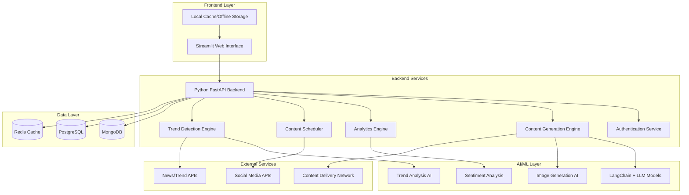

# Design Document: AI for Bharat Content Ecosystem

## Overview

The AI for Bharat Content Ecosystem is a comprehensive platform built using Streamlit for the frontend interface, Python for backend logic, and cloud databases for data persistence. The system integrates five core AI-powered components: multilingual script generation, visual content creation, analytics dashboard, trend detection, and intelligent content planning. The architecture prioritizes accessibility for Tier-2, Tier-3, and rural Indian content creators through optimized performance and offline capabilities.

## Architecture

### High-Level Architecture



### Technology Stack Details

- **Frontend**: Streamlit with custom components for rich UI interactions
- **Backend**: Python with FastAPI for REST API services
- **AI/ML**: LangChain for LLM orchestration, Hugging Face models for multilingual support
- **Database**: MongoDB for content storage, PostgreSQL for analytics, Redis for caching
- **Visualization**: Plotly for interactive analytics dashboards
- **Deployment**: Docker containers with cloud deployment (AWS/GCP/Azure)

## Components and Interfaces

### 1. AI Script Genius Component

**Purpose**: Generate culturally appropriate multilingual scripts with tone control and smart hooks.

**Core Classes**:
```python
class ScriptGenerator:
    def generate_script(self, topic: str, language: str, tone: str, duration: int) -> Script
    def add_cultural_context(self, script: Script, region: str) -> Script
    def generate_hooks(self, topic: str, language: str) -> List[Hook]
    def validate_grammar(self, script: Script) -> ValidationResult

class LanguageModel:
    def load_model(self, language: str) -> Model
    def generate_text(self, prompt: str, model: Model) -> str
    def apply_tone(self, text: str, tone: str) -> str

class CulturalContextEngine:
    def get_regional_references(self, region: str, topic: str) -> List[Reference]
    def validate_cultural_appropriateness(self, content: str, region: str) -> bool
```

**Interfaces**:
- REST API endpoints for script generation requests
- WebSocket connections for real-time script editing
- Integration with LangChain for LLM orchestration

### 2. AI Visual Studio Component

**Purpose**: Generate thumbnails and visuals optimized for Indian aesthetics and multiple formats.

**Core Classes**:
```python
class VisualGenerator:
    def generate_thumbnail(self, script: Script, format: str) -> Visual
    def apply_indian_aesthetics(self, visual: Visual, region: str) -> Visual
    def create_text_overlay(self, visual: Visual, text: str, language: str) -> Visual
    def generate_variations(self, base_visual: Visual, count: int) -> List[Visual]

class AestheticsEngine:
    def get_color_palette(self, region: str, topic: str) -> ColorPalette
    def get_cultural_motifs(self, region: str) -> List[Motif]
    def apply_typography(self, text: str, language: str) -> Typography

class FormatOptimizer:
    def resize_for_platform(self, visual: Visual, platform: str) -> Visual
    def optimize_for_bandwidth(self, visual: Visual, quality: str) -> Visual
```

**Interfaces**:
- Image generation API with format specifications
- Real-time preview system for visual editing
- CDN integration for optimized image delivery

### 3. Bharat Analytics Hub Component

**Purpose**: Provide comprehensive analytics with regional insights and sentiment analysis.

**Core Classes**:
```python
class AnalyticsEngine:
    def collect_metrics(self, content_id: str) -> Metrics
    def analyze_regional_performance(self, content_id: str) -> RegionalAnalytics
    def perform_sentiment_analysis(self, comments: List[Comment]) -> SentimentResult
    def generate_insights(self, metrics: Metrics) -> List[Insight]

class MetricsCollector:
    def track_engagement(self, content_id: str, platform: str) -> EngagementData
    def collect_demographic_data(self, content_id: str) -> Demographics
    def monitor_real_time_performance(self, content_id: str) -> RealTimeMetrics

class VisualizationEngine:
    def create_dashboard(self, analytics: Analytics) -> Dashboard
    def generate_charts(self, data: AnalyticsData) -> List[Chart]
    def create_regional_heatmap(self, regional_data: RegionalData) -> Heatmap
```

**Interfaces**:
- Plotly-based interactive dashboards
- Real-time data streaming for live metrics
- Export functionality for analytics reports

### 4. Trend Radar Component

**Purpose**: Detect trending topics and calculate digital momentum for content strategy.

**Core Classes**:
```python
class TrendDetector:
    def monitor_trends(self, region: str, language: str) -> List[Trend]
    def calculate_momentum(self, trend: Trend) -> MomentumScore
    def categorize_trends(self, trends: List[Trend]) -> CategorizedTrends
    def generate_recommendations(self, user_profile: UserProfile, trends: List[Trend]) -> List[Recommendation]

class DataAggregator:
    def collect_social_media_data(self, platforms: List[str]) -> SocialData
    def collect_news_data(self, sources: List[str]) -> NewsData
    def aggregate_search_trends(self, region: str) -> SearchTrends

class TrendAnalyzer:
    def analyze_trend_velocity(self, trend_data: TrendData) -> Velocity
    def predict_trend_lifecycle(self, trend: Trend) -> Lifecycle
    def identify_emerging_trends(self, data: AggregatedData) -> List[EmergingTrend]
```

**Interfaces**:
- Real-time trend monitoring APIs
- Alert system for emerging trends
- Integration with external trend data sources

### 5. Smart Content Planner Component

**Purpose**: AI-powered content scheduling and calendar management with optimal timing.

**Core Classes**:
```python
class ContentScheduler:
    def analyze_audience_patterns(self, user_id: str) -> AudiencePatterns
    def recommend_posting_times(self, content: Content, patterns: AudiencePatterns) -> List[OptimalTime]
    def schedule_content(self, content: Content, schedule: Schedule) -> ScheduledContent
    def handle_conflicts(self, schedule: Schedule) -> ResolvedSchedule

class CalendarManager:
    def create_content_calendar(self, user_id: str, month: int, year: int) -> Calendar
    def add_cultural_events(self, calendar: Calendar, region: str) -> Calendar
    def optimize_content_flow(self, calendar: Calendar) -> OptimizedCalendar

class PlatformIntegrator:
    def publish_to_platform(self, content: Content, platform: str) -> PublishResult
    def format_for_platform(self, content: Content, platform: str) -> FormattedContent
    def track_cross_platform_performance(self, content_id: str) -> CrossPlatformMetrics
```

**Interfaces**:
- Calendar visualization with drag-and-drop scheduling
- Platform-specific publishing APIs
- Automated scheduling with conflict resolution

## Data Models

### Core Data Structures

```python
@dataclass
class User:
    user_id: str
    email: str
    phone: str
    preferred_languages: List[str]
    target_regions: List[str]
    content_categories: List[str]
    subscription_tier: str
    created_at: datetime
    last_active: datetime

@dataclass
class Content:
    content_id: str
    user_id: str
    title: str
    script: Script
    visuals: List[Visual]
    language: str
    category: str
    status: ContentStatus
    created_at: datetime
    scheduled_at: Optional[datetime]
    published_at: Optional[datetime]

@dataclass
class Script:
    script_id: str
    content: str
    language: str
    tone: str
    hooks: List[Hook]
    cultural_references: List[Reference]
    word_count: int
    estimated_duration: int

@dataclass
class Visual:
    visual_id: str
    image_url: str
    format: str  # "16:9" or "9:16"
    dimensions: Tuple[int, int]
    aesthetic_style: str
    text_overlays: List[TextOverlay]
    cultural_elements: List[str]

@dataclass
class Analytics:
    content_id: str
    platform_metrics: Dict[str, PlatformMetrics]
    regional_performance: RegionalPerformance
    sentiment_analysis: SentimentResult
    engagement_timeline: List[EngagementPoint]
    recommendations: List[str]

@dataclass
class Trend:
    trend_id: str
    topic: str
    keywords: List[str]
    region: str
    language: str
    momentum_score: float
    category: str
    detected_at: datetime
    predicted_peak: datetime
    confidence_level: float
```

### Database Schema Design

**MongoDB Collections** (Document Storage):
- `users` - User profiles and preferences
- `content` - Generated content and metadata
- `scripts` - Script versions and edits
- `visuals` - Visual assets and variations
- `trends` - Detected trends and analysis

**PostgreSQL Tables** (Relational Analytics):
- `analytics_metrics` - Time-series performance data
- `engagement_events` - User interaction events
- `platform_performance` - Cross-platform analytics
- `regional_insights` - Geographic performance data
- `sentiment_scores` - Comment sentiment analysis

**Redis Cache** (Performance Optimization):
- User session data
- Frequently accessed content
- Real-time trend data
- Analytics dashboard cache

## Error Handling

### Error Categories and Responses

**AI Generation Errors**:
- LLM service unavailable → Fallback to cached templates
- Image generation failure → Provide default visuals
- Language model errors → Graceful degradation to simpler models

**Data Processing Errors**:
- Analytics calculation failures → Return partial results with warnings
- Trend detection errors → Use cached trend data
- Database connection issues → Implement retry logic with exponential backoff

**User Interface Errors**:
- Network connectivity issues → Enable offline mode
- Large file uploads → Implement chunked upload with progress tracking
- Session timeouts → Auto-save drafts and restore on reconnection

**External Service Errors**:
- Social media API failures → Queue for retry and notify user
- CDN unavailability → Serve from backup storage
- Third-party trend APIs down → Use internal trend analysis

### Error Recovery Strategies

```python
class ErrorHandler:
    def handle_llm_error(self, error: LLMError) -> FallbackResponse
    def handle_database_error(self, error: DatabaseError) -> RetryStrategy
    def handle_network_error(self, error: NetworkError) -> OfflineMode
    def log_error(self, error: Exception, context: Dict) -> None
    def notify_user(self, error: UserFacingError) -> Notification
```

## Testing Strategy

The testing approach combines unit tests for individual components and property-based tests for comprehensive validation of AI-generated content and system behavior.

**Unit Testing Focus**:
- Component integration points
- Error handling scenarios
- Database operations
- API endpoint functionality
- Cultural appropriateness validation

**Property-Based Testing Focus**:
- AI content generation consistency
- Cross-platform formatting preservation
- Analytics calculation accuracy
- Trend detection reliability
- Scheduling optimization correctness

**Testing Configuration**:
- Property tests run with minimum 100 iterations using Hypothesis (Python)
- Each property test references its corresponding design property
- Integration tests validate end-to-end user workflows
- Performance tests ensure accessibility for low-bandwidth users

**Test Environment Setup**:
- Mock external APIs for consistent testing
- Test databases with representative multilingual data
- Simulated network conditions for offline testing
- Cultural appropriateness test datasets for each supported region

## Correctness Properties

*A property is a characteristic or behavior that should hold true across all valid executions of a system—essentially, a formal statement about what the system should do. Properties serve as the bridge between human-readable specifications and machine-verifiable correctness guarantees.*

### Property 1: Multilingual Script Generation Consistency
*For any* supported language, topic, and tone combination, the AI Script Genius should generate culturally appropriate scripts in the specified language that match the requested tone and include attention-grabbing hooks within the first 15 seconds.
**Validates: Requirements 1.1, 1.2, 1.3, 1.4**

### Property 2: Script Validation and Quality Assurance
*For any* generated script, the system should validate grammatical correctness and cultural appropriateness before presenting it to users, ensuring all scripts meet quality standards.
**Validates: Requirements 1.5**

### Property 3: Visual Format and Aesthetic Compliance
*For any* visual content request, the AI Visual Studio should generate thumbnails in both 16:9 and 9:16 formats that incorporate appropriate Indian aesthetic elements and provide multiple variations for user choice.
**Validates: Requirements 2.1, 2.2, 2.4**

### Property 4: Script-Visual Content Alignment
*For any* generated script, the visual suggestions should be relevant to and complement the script content, with text overlays that are readable and culturally appropriate for the target audience.
**Validates: Requirements 2.3, 2.5**

### Property 5: Comprehensive Analytics Data Presentation
*For any* published content, the analytics dashboard should display all required performance metrics (views, engagement rates, shares, comments) with regional engagement patterns and geographic distribution.
**Validates: Requirements 3.1, 3.2**

### Property 6: Sentiment Analysis Accuracy
*For any* set of comments and feedback, the sentiment analysis should correctly categorize responses as positive, negative, or neutral with consistent classification criteria.
**Validates: Requirements 3.3**

### Property 7: Cross-Language Performance Insights
*For any* content published in multiple languages or regions, the analytics should provide comparative insights and actionable recommendations based on performance differences.
**Validates: Requirements 3.4, 3.5**

### Property 8: Trend Categorization and Momentum Calculation
*For any* detected trending topic, the system should correctly categorize it by region, language, and content type while calculating accurate Digital Momentum scores.
**Validates: Requirements 4.2, 4.3**

### Property 9: Personalized Trend Recommendations
*For any* user profile and content history, the trend recommendations should be personalized and relevant to the user's niche and target audience.
**Validates: Requirements 4.4**

### Property 10: Optimal Content Scheduling
*For any* content and audience activity data, the Smart Content Planner should recommend optimal posting times and appropriate platforms while preventing scheduling conflicts.
**Validates: Requirements 5.1, 5.2, 5.3**

### Property 11: Cultural Event-Aware Scheduling
*For any* content scheduled during regional festivals or cultural events, the system should consider these occasions in timing optimization.
**Validates: Requirements 5.4**

### Property 12: User Authentication and Security
*For any* user authentication attempt, the system should securely verify credentials and maintain session security throughout the user's interaction.
**Validates: Requirements 6.2**

### Property 13: Profile-Based Recommendation Adaptation
*For any* user profile update, the AI recommendations and content suggestions should adjust accordingly to reflect the new preferences and settings.
**Validates: Requirements 6.3**

### Property 14: Content History and Data Persistence
*For any* user-generated content, analytics, and preferences, the system should maintain complete history for personalization and allow data export when requested.
**Validates: Requirements 6.4**

### Property 15: Content Versioning and Language Consistency
*For any* content editing session, the system should maintain language consistency during real-time edits, save draft versions for later continuation, and preserve both original and edited versions.
**Validates: Requirements 7.2, 7.4, 7.5**

### Property 16: Cross-Platform Content Formatting
*For any* content published to multiple platforms, the system should automatically format content appropriately for each platform's requirements and handle platform-specific timing.
**Validates: Requirements 8.2, 8.4**

### Property 17: Platform Integration Error Handling
*For any* platform integration failure, the system should notify users and provide alternative publishing options while maintaining unified analytics across successful publications.
**Validates: Requirements 8.3, 8.5**

### Property 18: Offline Functionality and Sync
*For any* offline content creation session, the system should provide basic script generation and editing capabilities using cached models, then sync changes when connectivity is restored.
**Validates: Requirements 9.2, 9.4**

### Property 19: Bandwidth-Optimized Performance
*For any* low-bandwidth connection, the system should cache frequently used resources locally and gracefully degrade non-critical functionality while maintaining essential features.
**Validates: Requirements 9.3, 9.5**

### Property 20: Data Security and Privacy
*For any* user data and content, the system should encrypt information both in transit and at rest, permanently delete data within 30 days when requested, and provide complete user control over data sharing preferences.
**Validates: Requirements 10.1, 10.3, 10.5** 